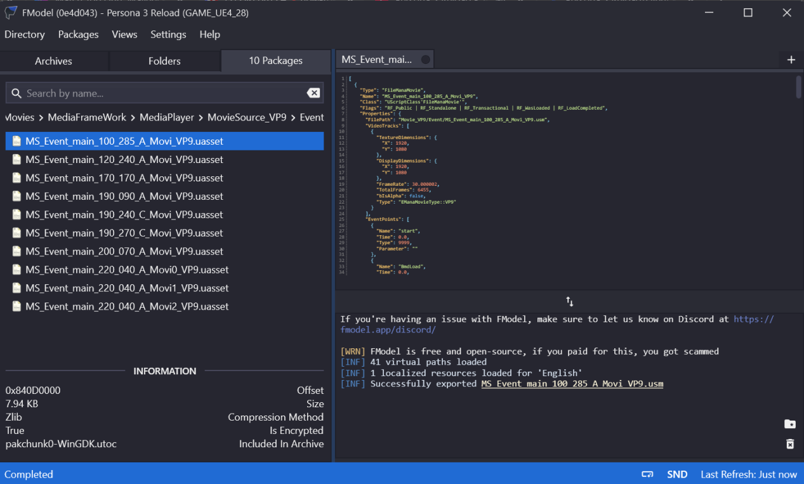
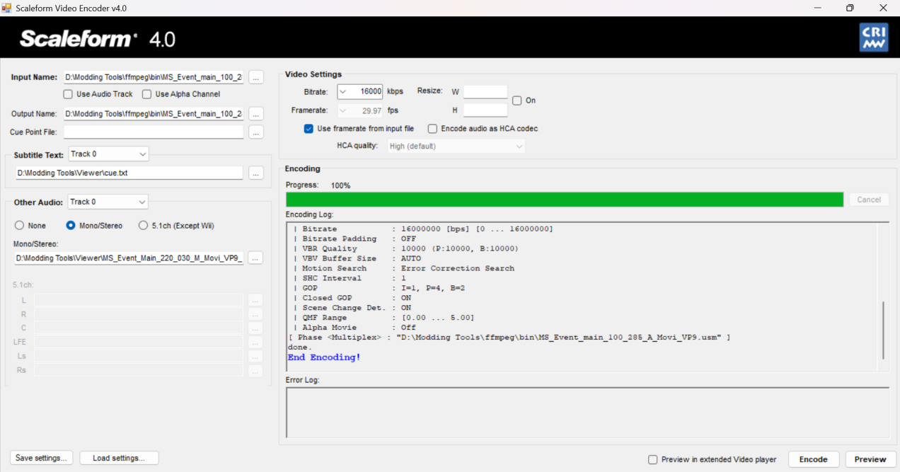

import { Aside, Tabs, TabItem } from "@astrojs/starlight/components";

<Aside type="caution">
  These docs are under construction as adding in cuepoints is still relatively new. TODO: - update docs to show how to add new cuepoints -
</Aside>

## Tools You'll Need

- [Scaleform Tool](https://www.mediafire.com/file/6acalge6xd1vn2e/Scaleform_VideoEncoder.zip/file/)
- [VGMToolbox](https://sourceforge.net/projects/vgmtoolbox/)
- [FFMPEG](https://ffmpeg.org/download.html)

## Finding the cuepoints file
1. Using the Amicitia Wiki find the file you want to modify.
2. Open FModel and navigate to P3R/Content/Xrd777/Movies/MediaFrameWork/MediaPlayerMovieSource_VP9.
3. Now depending on the category of the movie you want to modify you will either open the Anim or Event folder 
4. After opening the folder u need, search for a file that matches the name of the USM you want to modify.
5. Now double click the file to see a preview of it in fmodel, it should look something like this.



## Replicating the cuepoints
1. Now we will be replicating the cuepoints in the USM by analysing the json in fmodel.
2. Now what we need to look for is the EventPoints list in the json, where each entry is an individual cuepoint. Now we will begin replicating the cuepoints in a text file named cue.txt (you may name the file anything you want)
3. Now copy the below items and paste them into the text file.
```mdx
;Time, Value, EventPointName, String
1000
```
4. Now each line we add to this file will be an individual cuepoint with the general format shown below.
```mdx
Time (ms) | Type | Name | Parameter
```
So for example, if we see this eventpoint in the json we opened in fmodel earlier:
```mdx
{
          "Name": "ゆかり台詞01",
          "Time": 12.2,
          "Type": 1002,
          "Parameter": "MSG_000_0_0,0,29,"
}
```
Then we will replicate it in the text file as follows:
```mdx
1220,1002,ゆかり台詞01,MSG_000_0_0,0,29,
```
<Aside>
The time in the json is in seconds but the time in the cuepoints text file (cue.txt) is in milliseconds so you need to multiply the time value in the Fmodel json by 1000.
</Aside>

## Encoding the USM
1. Now that we have our cuepoint text file ready, we will need a video source and an audio source (if you are not encoding a pre-rendered/event USM). Make sure the video source has the .avi extension and the audio has the .wav extension.
2. Open Scaleform/Sofdec Encoder, and import the video source.
3. Now for audio, make sure that the use audio checkbox next to video source is turned off. To add audio to your USM, you will need two different wav files, one for japanese and one for english. Use the Other audio option below and select mono/stereo. Then add your japanese wav to track 0 and your english wav to track 1.

<Aside>Skip step 3 if the USM does not support a built in audio track and uses cuepoints to call voicelines/BGM.</Aside>

4. Now under the cuepoint file field add the path to your cuepoint text file. Your window should look like this.



<Aside> 
After you are done with the previous step click on encode. This step might take a long time so have a cup of coffee while you wait.
</Aside>

5. After the USM is encoded, create a Reloaded mod and add a dependency on Ryo Framework (Don't forget to select P3R from the list of supported apps!). Then select your mod in Reloaded and click on open folder.
6. Now in the folder that opens, create a folder named Ryo and inside the Ryo folder create a folder named P3R. Inside the P3R folder add the encoded USM. Make sure the USM is named the same as the original USM. For example: MS_Event_main_100_285_A_Movi_VP9.usm for the hero awakening USM.
7. Now enable your newly created mod and try out the USM ingame.

<Aside>
Some useful info about movie IDs in P3R's mod menu
1-20: Anim Movies
60 and above: Event Movies
</Aside>
